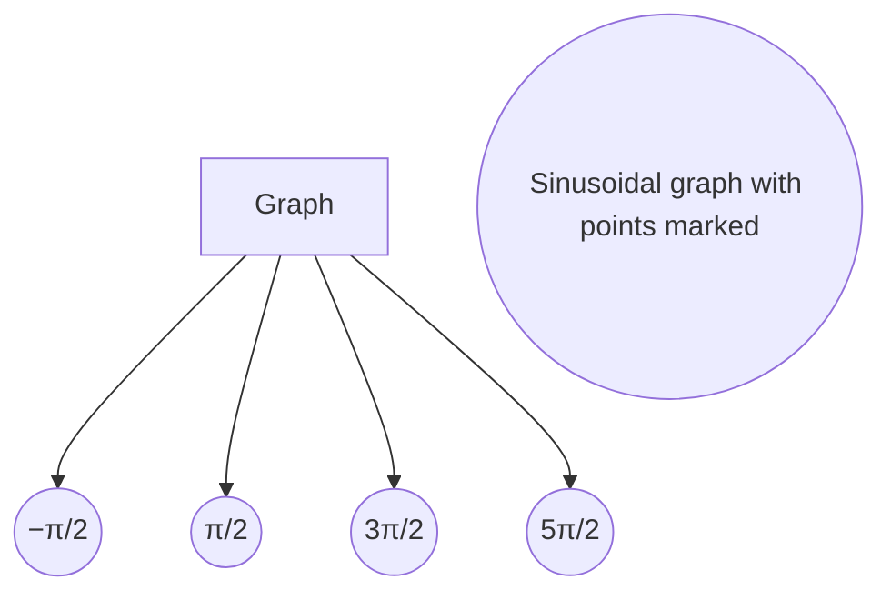

## IMG_3976.JPG

```markdown
# Equation

\( y = \frac{1}{2} \cos 2x \)

# Table

| \( x \)      | \( 2x \)   | \( y = \frac{1}{2} \cos 2x \) |
|--------------|------------|------------------------------|
| \( 0 \)      | \( 0 \)    | \( 0 \)                      |
| \( \frac{\pi}{4} \) | \( \frac{\pi}{2} \) | \( 0.5 \)                    |
| \( \frac{\pi}{2} \) | \( \pi \)   | \( 0 \)                      |
| \( \frac{3\pi}{4} \) | \( \frac{3\pi}{2} \) | \( -0.5 \)                  |
| \( \pi \)    | \( 2\pi \) | \( 0 \)                      |
```


---

## IMG_3977.JPG

```markdown
5) 2cos\( \frac{3}{10}x \)

| \( x \) | \( \frac{3}{10}x \) | \( y = 2\cos \) |
|:-------:|:-------------------:|:--------------:|
|   0     |         0           |       2        |
|   2     |   \( \frac{2\pi}{3} \) |    0          |
|   3π    |         3π          |      -2        |
| \( \frac{3π}{2} \) | \( \pi \)  |       0        |
|  3π     | \( \frac{4\pi}{3} \) |      2         |
```

---

## IMG_3978.JPG

```markdown
5). \( y = 2\cos\left(\frac{3}{2}x\right) \)

| \( x \)    | \(\frac{3}{2}x\) | \( y = 2\cos\) |
|------------|------------------|----------------|
| 0          | 0                | 2              |
| \(\frac{\pi}{3}\) | \(\frac{\pi}{2}\)      | 0              |
| \(\pi\)    | \(\frac{3\pi}{2}\)   | \(-2\)           |
| \(\frac{3\pi}{2}\) | \( \frac{9\pi}{4} \)   | 0              |
| \( 2\pi \) | \(3\pi\)          | 2              |
```


---

## IMG_3979.JPG

```markdown
\( f(x) = -2 \cos(x + \frac{\pi}{2}) + 3 \)

### Transformations:
- Amplitude: 2
- Phase Shift: \(\frac{\pi}{2}\)
- Vertical Shift: 3
- Reflection: Yes

### Trigonometric Values:
- \(\sin(-\frac{\pi}{3}) = -\frac{\sqrt{3}}{2}\)
- \(\tan(\pi) = 0\)
- \(\cos(\frac{\pi}{6}) = \frac{\sqrt{3}}{2}\)
- \(\csc(\pi) = \text{Undefined}\)
- \(\sec(\frac{\pi}{3}) = 2\)
- \(\tan(\frac{\pi}{3}) = \sqrt{3}\)
- \(\cos(\frac{\pi}{2}) = 0\)
- \(\sin(\frac{\pi}{2}) = 1 = \frac{\sqrt{3}}{\sqrt{3}} = \frac{2}{2}\)
- \(\csc(\frac{\pi}{2}) = 1\)
- \(\sin(\frac{\pi}{3}) = \frac{\sqrt{3}}{2} = \frac{\sqrt{3}}{\sqrt{3}}\)
- \(\cot(\pi) = \text{Undefined}\)
- \(\sec(\frac{\pi}{6}) = \frac{2}{\sqrt{3}}\)


```

---

## IMG_3980.JPG

```markdown
## 1) \( y = \frac{5}{3} \cos \left( \frac{1}{5}x \right) \)

| \( x \)     | \( \frac{1}{5}x \) | \( y = \cos x \) | \( y = \frac{5}{3} \cos x \) |
|-------------|---------------------|------------------|-----------------------------|
| 0           | 0                   | 1                | \(\frac{5}{3}\)             |
| \(\frac{\pi}{2}\) | \(\frac{\pi}{10}\)          | 0                | 0                           |
| \(\pi\)     | \(\frac{\pi}{5}\)           | -1               | \(-\frac{5}{3}\)            |
| \(\frac{3\pi}{2}\) | \(\frac{3\pi}{10}\)          | 0                | 0                           |
| \(2\pi\)    | \(\frac{2\pi}{5}\)          | 1                | \(\frac{5}{3}\)             |

## 2) \( y = -2 \sin \left( \frac{3}{5} x \right) \)

| \( x \)     | \(\frac{3}{5}x\)   | \( y = -2\sin x \) |
|-------------|---------------------|--------------------|
| 0           | 0                   | 0                  |
| \(\frac{\pi}{3}\) | \(\frac{\pi}{5}\)           | \(-2\)               |
| \(\frac{2\pi}{3}\) | \(\frac{2\pi}{5}\)          | 0                   |
| \(\pi\)     | \(\frac{3\pi}{5}\)          | 2                    |
| \(\frac{4\pi}{3}\) | \(\frac{4\pi}{5}\)           | 0                   |
| \(\frac{5\pi}{3}\) | \(\pi\)                | \(-2\)               |
| \(2\pi\)    | \(\frac{6\pi}{5}\)          | 0                    |
```


---

## IMG_3981.JPG

```markdown
3) \( y = \frac{1}{2} \cos(2x) \)

| \( x \) | \( 2x \) | \( y = \frac{1}{2} \cos(2x) \) |
|---------|---------|---------------------------|
| 0       | 0       | 0.5                       |
| \( \frac{\pi}{4} \) | \( \frac{\pi}{2} \) | 0                         |
| \( \frac{\pi}{2} \) | \(\pi\)   | -0.5                      |
| \( \frac{3\pi}{4} \) | \( \frac{3\pi}{2} \) | 0                        |
| \( \pi \)  | \( 2\pi \) | 0.5                       |

4) \( y = -\frac{3}{5} \sin(\frac{1}{2}x) \)

| \( x \) | \( \frac{1}{2}x \) | \( y = -\frac{3}{5} \sin(\frac{1}{2}x) \) |
|---------|-----------------|-----------------------------------|
| 0       | 0               | 0                                 |
| \( \pi \)  | \( \frac{\pi}{2} \)   | -0.6                           |
| \( 2\pi \) | \(\pi\)  | 0                                  |
| \( 3\pi \) | \( \frac{3\pi}{2} \) | 0.6                               |
| \( 4\pi \) | \( 2\pi \) | 0                                  |

5) \( y = 2 \cos(\frac{3}{2} x) \)

| \( x \) | \( \frac{3}{2}x \) | \( y = 2 \cos(\frac{3}{2}x) \) |
|---------|-----------------|----------------------------|
| 0       | 0               | 2                          |
| \( \frac{2\pi}{3} \) | \(\pi\)   | 0                          |
| \( \frac{4\pi}{3} \) | \( 2\pi \) | -2                         |
| \( 2\pi \) | \( 3\pi \) | 0                          |
| \( \frac{8\pi}{3} \) | \( 4\pi \) | 2                          |
```


---

## IMG_3982.JPG

```markdown
1) \( y = -3 \sin 3x \)

| \( x \) | \( 3x \) | \( y = -3 \sin x \) |
|---------|----------|-----------------------|
| \( 0 \) | \( 0 \) | \( 0 \)               |
| \( \frac{\pi}{6} \) | \( \frac{\pi}{2} \) | \( -3 \)           |
| \( \frac{\pi}{3} \) | \( \pi \) | \( 0 \)               |
| \( \frac{\pi}{2} \) | \( \frac{3\pi}{2} \) | \( 3 \)            |
| \( \frac{2\pi}{3} \) | \( 2\pi \) | \( 0 \)             |

---

2) \( y = 2 \cos 6x \)  
Period: \( \frac{\pi}{3} \)  
Amplitude: \( 2 \)

---

3) \( y = 3 \sin \frac{\pi}{4}x \)  
Period: \( \frac{2\pi}{\frac{\pi}{4}} = 8 \)  
Amplitude: \( 3 \)

---

4) \( y = -2.5 \sin (\frac{\pi}{3}x) \)  
Period: \( \frac{2\pi}{\frac{\pi}{3}} = 6 \)  
Amplitude: \( 2.5 \)

---

5) \( y = \frac{2}{3} \cos 3x \)  
Period: \( \frac{2\pi}{3} \)  
Amplitude: \( \frac{2}{3} \)
```


---

## IMG_3983.JPG

```markdown
1) 
   \( y = -3\cos\left(\frac{3x - \pi}{6}\right) - 1 \)

2) 
   \( y = \frac{3}{2} \sin \left( 2x + \frac{\pi}{3} \right) \)
   
   \( y = \frac{1}{3} \sin \left( 2x + \frac{\pi}{2} \right) + 3 \)

3) 
   \( y = \frac{3}{5} \cos(3x - \pi) + 2 \)

   \( 3 \cos \left( x + \frac{\pi}{2} \right) \)

4) 
   \( y = 2 \cos \left( x - \frac{\pi}{4} \right) \)

   \[
   \begin{array}{c|c}
   \theta & \cos(\theta) \\
   \hline
   0 & 2 \\
   \frac{\pi}{2} & 0 \\
   \pi & -2 \\
   \frac{3\pi}{2} & 0 \\
   2\pi & 2 \\
   \end{array}
   \]

5)
   \( y = \frac{2}{3} \cos\left( x - \frac{\pi}{3} \right) \)

6) 
   \( y = \frac{3}{5} \sin\left( x - \frac{2\pi}{3} \right) \)
```

---

## IMG_3984.JPG

Here is the transcription in Markdown:

```markdown
1) \( y = 2 \cos \left( \frac{3}{3}x \right) - 1 \)

| \( x \)      | math   | \( 3x \)        |
|--------------|--------|-----------------|
| 0            | 0 = 0  | 0               |
| \(\frac{\pi}{3}\) | \(\frac{1}{3} = \frac{\pi}{3}\) | \(\pi\)               |
| \(\pi\)      | \(1 = \pi\) | \(3\pi\)           |
| \(\frac{3\pi}{2}\) | \(\frac{3}{2} = \frac{3\pi}{2}\) | \(\frac{9\pi}{2}\)  |
| \(2\pi\)     | \(2 = 2\pi\) | \(6\pi\)          |

\[
y = 2 \cos 
\]
\[
\begin{align*}
-1 & \\
0  & \\
1  & \\
0  & \\
-1 & \\
\end{align*}
\]

Coordinates:  
- \((0, 1)\)  
- \(\left(\frac{\pi}{3}, -1\right)\)  
- \(\left(\pi, -3\right)\)  
- \(\left(\frac{3\pi}{2}, -1\right)\)  
- \((2\pi, -1)\)  

---

2) \( y = -\frac{3}{5} \sin 3x - 3 \)

| \( x \)      | math   | \( 3x \)        |
|--------------|--------|-----------------|
| 0            | 0 = 0  | 0               |
| \(\frac{\pi}{3}\) | \(\frac{1}{3} = \frac{\pi}{3}\) | \(\pi\)               |
| \(\pi\)      | \(1 = \pi\) | \(3\pi\)           |
| \(\frac{3\pi}{2}\) | \(\frac{3}{2} = \frac{3\pi}{2}\) | \(\frac{9\pi}{2}\)  |
| \(2\pi\)     | \(2 = 2\pi\) | \(6\pi\)          |

Reflection  
\[ y = 3 \sin \]  
\[
\begin{align*}
0  & \\
-3 & \\
0  & \\
3  & \\
0  & \\
-3 & \\
\end{align*}
\]

Coordinates:  
- \((0, -3)\)  
- \(\left(\frac{\pi}{3}, -3\right)\)  
- \(\left(\pi, -3\right)\)  
- \(\left(\frac{3\pi}{2}, 0\)\)  
- \((2\pi, -3)\)  

---

3) \( y = -2 \cos \left( \frac{2}{3}x \right) + 2 \)

| \( x \)      | math   | \( \frac{3}{2}x \)  |
|--------------|--------|---------------------|
| 0            | 0 = 0  | 0                   |
| \(\frac{3\pi}{4}\) | \(\frac{3}{4} = \frac{3\pi}{4}\) | \(\pi\)         |
| \(\pi\)      | \(\frac{1}{2} = \pi\) | \(2\pi\)             |
| \(\frac{5\pi}{3}\) | \(\frac{5}{3} = \frac{5\pi}{3}\) | \(3\pi\)       |
| \(2\pi\)     | \(2 = 2\pi\) | \(4\pi\)                 |

Reflection  
\[ y = 2 \cos \]  
\[
\begin{align*}
0 & \\
2 & \\
0 & \\
2 & \\
0 & \\
\end{align*}
\]

Coordinates:  
- \((0, 0)\)  
- \(\left(\frac{3\pi}{4}, 2\right)\)  
- \((\pi, 4)\)  
- \(\left(\frac{5\pi}{3}, 2\right)\)  
- \((2\pi, 0)\)  
```